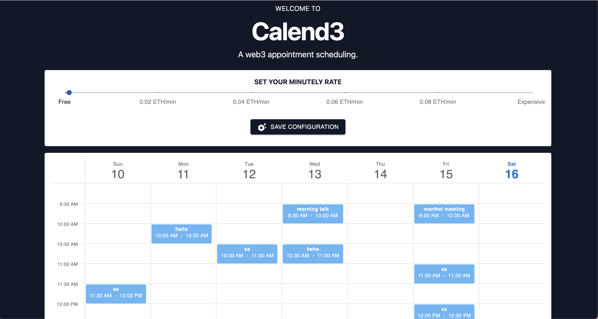
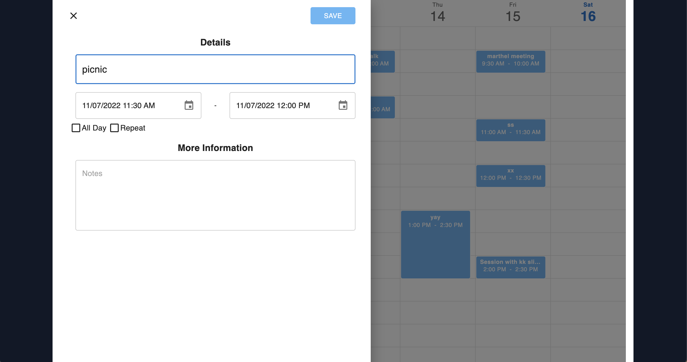
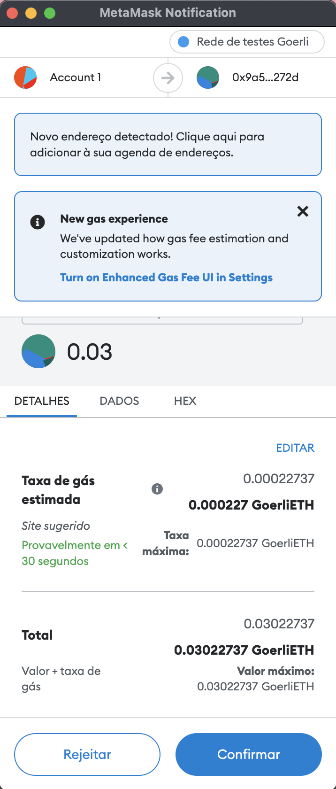
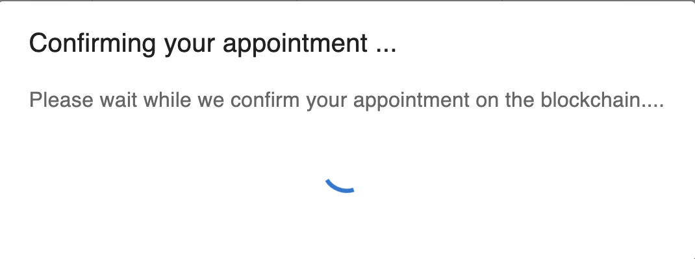
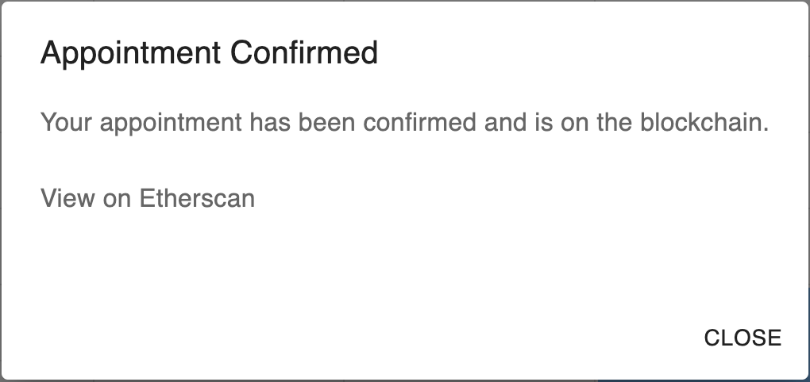

# Web3 Calendly App

This project is a Web3 Calendly Dapp, a web3 appointment scheduling.

It was build following the [tutorial](https://www.youtube.com/watch?v=WFCqGJ-rxJY&list=PLvzuUVysUFOt-PKemi0LNSArIcUcr69QE) from [Part Time Larry](https://www.youtube.com/c/parttimelarry).
The written tutorial can be found [here](https://hackingthemarkets.com/). Amazing tutorial btw :D!

The Dapp from this repo can be accessed in this [url](https://amazing-bonbon-09c4f8.netlify.app/).

## Features

- [HardHat](https://hardhat.org/): used to set up a local environment.
- [Solidity](https://docs.soliditylang.org/en/v0.8.15/) and Smart Contracts: All data is stored in a distributed and public database: The Ethereum Blockchain.
- [Metamask](https://metamask.io/): Clients connects to the application using an Ethereum Wallet. In our case it is Metamask wallet.
- [Alchemy](https://www.alchemy.com/): Running an Ethereum node ourselves is time consuming and we are busy people. That is why it was used Alchemy, a popular node provider to deploy the smart contract.
- [React](https://reactjs.org/): used for the frontend development.
- [Material UI](https://mui.com/pt/): A popular component library that we can use to add complex UI components without reinventing the wheel. The scheduler components are based in this library.
- Appointment and Payments: The owner of the calendar will receive payment in ether for each meeting. Calculated based on the start and end time, multiplied by the rate per minute.
- [Ethers.js](https://docs.ethers.io/v5/): Used along ABI (ApplicationBinary Interface) to call the smart contract from the UI.

## Interacting with the Dapp

To be able to schedule a meeting you need to have balance in your wallet. We are using the Goerli test network.
To get some Goerli ETH for testing you can get it in https://goerlifaucet.com/.

## The Dapp :)

